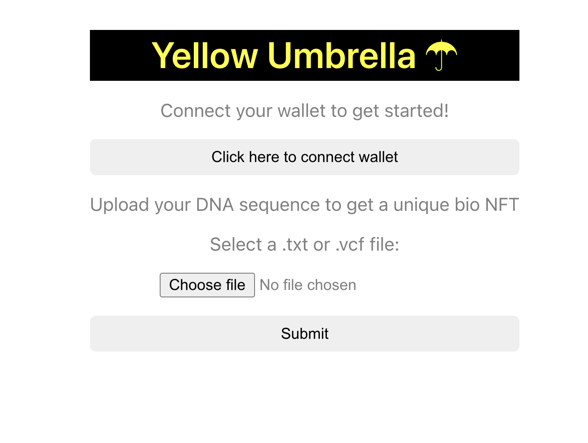

# Yellow Umbrella

Yellow Umbrella is a game where players upload their genetic sequence and mint a unique NFT, based on the sequence. Players can recombine their NFT with that of other players to generate new NFTs with different traits. Additionally, they can use the platform to discover more about their health.

It is the first of a series of games that Billions Health is building to encourage people to create and engage with their health-related data.


## Table of Contents

- [About](#about)
- [Install](#install)
- [Frontend](#frontend)
- [Next Steps](#next-steps)


## About

Billions Health are building a play2health gaming platform to bring the world's health data into one composable protocol.

The game play dynamics of Yellow Umbrella are described in more detail in [this slideshow presentation](https://docs.google.com/presentation/d/e/2PACX-1vQCfvrXzmRl_S6mZuYX0GJFXwi1IvxH_6aHzyIGn9khcwnyjly6KjLxw-Sivpt8YTUlbLv8s8AtemJb/pub?start=false&loop=false&delayms=3000) and [this accompanying presentation](https://www.youtube.com/watch?v=u8lxFdalQSs&t=26m30s).

The current backend logic is that (1) a player's genetic data file is renamed based on their wallet address, (2) the file is uploaded to an encrypted Amazon S3 bucket, (3) this file upload triggers an AWS Lambda function to calculate a genetic similarity score, (4) this is fed back to the backend, which then initiates the minting of an NFT based on the characteristics.


## Install

```sh
git clone https://github.com/billionshealth/yellow-umbrella
cd yellow-umbrella
```


#### Run back-end
```sh
cd backend
npm install
npm start
```


#### Run front-end

```sh
cd frontend
npm install
npm start
```


#### Deploy to AWS Lambda
Install AWS SAM CLI as per [docs](https://docs.aws.amazon.com/serverless-application-model/latest/developerguide/serverless-sam-cli-install.html). Then:

```sh
cd gene-similarity-sam
sam build
sam deploy
```


## Frontend

The current working template for the front-facing web app is the following:



## Next steps

1. Write smart contracts for minting NFTs on Oasis
2. Add front-end page to include ability to (1) request NFT minting, (2) see current minted NFTs and (3) request to recombine NFT with other players (based on their wallet address).
3. Ensure generalisability to different genetic data file types and sources
4. Turn genetic upload and analysis pipeline into a modular, re-usable comnponent for other health-related games

