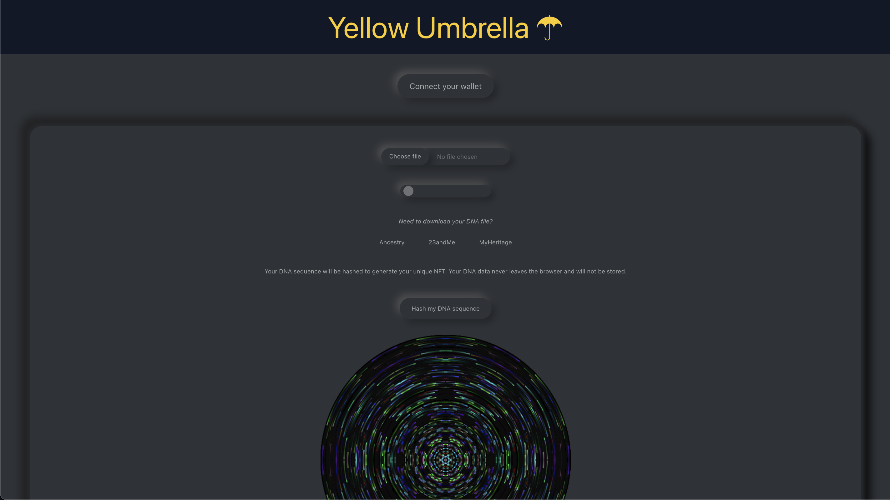

# Yellow Umbrella

Yellow umbrella is a generate NFT game based on DNA exploration.

Players use their genetic sequence to mint a unique NFT. Players can recombine their NFT with that of other players to generate new NFTs with different traits. Additionally, they can use the platform to discover more about their health.


## Table of Contents

- [Install](#install)
- [Frontend](#frontend)
- [Next Steps](#next-steps)


## Install

```sh
git clone https://github.com/billionshealth/yellow-umbrella
cd yellow-umbrella
```


#### Deploy contracts
From within the frontend folder, in one terminal window:
```sh
npx hardhat node
```

In another terminal window:
```sh
npx hardhat run scripts/deploy.js --network <network>
```

To deploy on localhost, network is "localhost". To deploy on Oasis Emerald Testnet, use "emerald_testnet".


#### Run front-end

```sh
cd frontend
npm install
npm run build-css
npm run compile
npm run start
```


#### Deploy to AWS Lambda
Install AWS SAM CLI as per [docs](https://docs.aws.amazon.com/serverless-application-model/latest/developerguide/serverless-sam-cli-install.html). Then:

```sh
cd gene-similarity-sam
sam build
sam deploy
```


## Frontend

The current working template for the front-facing web app is the following:



## Next steps

1. Add functionality for recombining NFTs with others
2. Increase health-related information made available via the DApp
